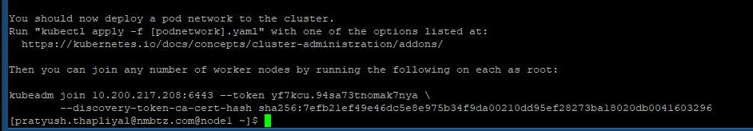

# Install on RHEL 9

### 1. Disable swap space

For best performance, Kubernetes requires that swap is disabled on the host system. This is because memory swapping can significantly lead to instability and performance degradation.

To disable swap space, we run the command:

```
$ sudo swapoff -a
```

To make the changes persistent, edit the /etc/fstab file and remove or comment out the line with the swap entry and save the changes.

### 2. Disable SELinux

Additionally, we need to disable SELinux and set it to ‘permissive’ in order to allow smooth communication between the nodes and the pods.

To achieve this, open the SELinux configuration file.

```
$ sudo vi /etc/selinux/config
```

Change the SELINUX value from enforcing to permissive.

```
SELINUX=permissive
```

### 3. Configure networking in master and worker node

Some additional network configuration is required for out master and worker nodes to communicate effectively. On each node, edit the  /etc/hosts file.

```
$ sudo vi /etc/hosts
```

Next, update the entries as shown

```
10.200.217.208 master-node-k8          // For the Master node
10.200.217.209 worker-node-1-k8       //  For the Worker node
10.200.217.210 worker-node-2-k8       //  For the Worker node
```

Save and exit the configuration file. Next, install the traffic control utility package:

```
$ sudo dnf install -y iproute-tc
```

### 4. Allow firewall rules for k8s

For seamless communication between the Master and worker node, we need to configure the firewall and allow some pertinent ports and services as outlined below.

On Master node, allow following ports,

```
$ sudo firewall-cmd --permanent --add-port=6443/tcp
$ sudo firewall-cmd --permanent --add-port=2379-2380/tcp
$ sudo firewall-cmd --permanent --add-port=10250/tcp
$ sudo firewall-cmd --permanent --add-port=10251/tcp
$ sudo firewall-cmd --permanent --add-port=10252/tcp
$ sudo firewall-cmd --reload
```

On Worker node, allow following ports,

```
$ sudo firewall-cmd --permanent --add-port=10250/tcp
$ sudo firewall-cmd --permanent --add-port=30000-32767/tcp
$ sudo firewall-cmd --reload
```

### 5. Install CRI-O container runtime

Create a modules configuration file for Kubernetes.

```
$ sudo vi /etc/modules-load.d/k8s.conf
```

Add these lines and save the changes

```
overlay
br_netfilter
```

Then load both modules using the modprobe command.

```
$ sudo modprobe overlay
$ sudo modprobe br_netfilter
```

Next, configure the required sysctl parameters as follows

```
$ sudo vi /etc/sysctl.d/k8s.conf
```

Add the following lines:

```
net.bridge.bridge-nf-call-iptables  = 1
net.ipv4.ip_forward                 = 1
net.bridge.bridge-nf-call-ip6tables = 1
```

Save the changes and exit. To confirm the changes have been applied, run the command:

```
$ sudo sysctl --system
```

To install CRI-O, set the $VERSION environment variable to match your CRI-O version. For instance, to install CRI-O version 1.26 set the $VERSION as shown:

```
$ export VERSION=1.26
```

Next, run the following commands:

```
$ sudo curl -L -o /etc/yum.repos.d/devel:kubic:libcontainers:stable.repo https://download.opensuse.org/repositories/devel:/kubic:/libcontainers:/stable/CentOS_8/devel:kubic:libcontainers:stable.repo
```

```
$ sudo curl -L -o /etc/yum.repos.d/devel:kubic:libcontainers:stable:cri-o:$VERSION.repo https://download.opensuse.org/repositories/devel:kubic:libcontainers:stable:cri-o:$VERSION/CentOS_8/devel:kubic:libcontainers:stable:cri-o:$VERSION.repo
```

Then use the DNF package manager to install CRI-O:

```
$ sudo dnf install cri-o
```

Next, enable CRI-O on boot time and start it:

```
$ sudo systemctl enable crio
$ sudo systemctl start crio
```

NOTE : Check that the the crio binary is present in $PATH variable

### 6. Install Kubernetes Packages

 Create a Kubernetes repository file.

```
$ sudo vi /etc/yum.repos.d/kubernetes.repo
```

And add the following lines.

```
[kubernetes]
name=Kubernetes
baseurl=https://packages.cloud.google.com/yum/repos/kubernetes-el7-x86_64
enabled=1
gpgcheck=1
repo_gpgcheck=1
gpgkey=https://packages.cloud.google.com/yum/doc/yum-key.gpg https://packages.cloud.google.com/yum/doc/rpm-package-key.gpg
exclude=kubelet kubeadm kubectl
```

Save the changes and exit. Finally, install k8s package as follows(The versions can be updated) : 

```
$ sudo dnf install -y kubelet-1.26.1 kubeadm-1.26.1 kubectl-1.26.1 --disableexcludes=kubernetes
```

Once installed, be sure to enable and start Kubelet service.

```
$ sudo systemctl enable kubelet
$ sudo systemctl start kubelet
```

At this juncture, we are all set to install Kubernetes cluster.

### 7. Create a Kubernetes cluster

We are going to initialize a Kubernetes cluster using the kubeadm command as follows. This initializes a control plane in the master node.

```
$ sudo kubeadm init --pod-network-cidr=192.168.10.0/16 
```

Once the control plane is created, you will be required to carry out some additional commands to start using the cluster.


Therefore, run the commands, sequentially.

```
$ mkdir -p $HOME/.kube
$ sudo cp -i /etc/kubernetes/admin.conf $HOME/.kube/config
$ sudo chown $(id -u):$(id -g) $HOME/.kube/config
```

At the very end of the output, you will be given the command to run on worker nodes to join the cluster. We will come to that later in the next step.

Also, be sure to remove taints from the master node:

```
$ kubectl taint nodes --all node-role.kubernetes.io/master-
```

### 8. Install Calico Pod Network Add-on

The next step is to install Calico CNI (Container Network Interface). It is an opensource project used to provide container networking and security. After Installing Calico CNI, nodes state will change to Ready state, DNS service inside the cluster would be functional and containers can start communicating with each other.

Calico provides scalability, high performance, and interoperability with existing Kubernetes workloads. It can be deployed on-premises and on popular cloud technologies such as Google Cloud, AWS and Azure.

To install Calico CNI, run the following command from the master node

```
$ kubectl apply -f https://raw.githubusercontent.com/projectcalico/calico/v3.25.0/manifests/calico.yaml
```

To confirm if the pods have started, run the command:

```
$ kubectl get pods -n kube-system
```

You should see that each pod is ‘READY’ and has the ‘RUNNING’ status as shown in the third column.

To verify the master node’s availability in the cluster, run the command:

```
$ kubectl get nodes
```

In addition, you can retrieve more information using the -o wide options.

```
$ kubectl get nodes -o wide
```

The above output confirms that the master node is ready. Additionally, you can check the pod namespaces:

```
$ kubectl get pods --all-namespaces
```
### 9. Adding worker node to the cluster

To add the worker node to the Kubernetes cluster, follow step 1 up until Step 6.  Once you are done, run the command generated by the master node for joining a worker node to the cluster. In our case, this will be:

```
$ sudo kubeadm join 10.200.217.208:6443 --token cqb8vy.iicmmqrb1m8u9cob --discovery-token-ca-cert-hash sha256:79748a56f603e6cc57f67bf90b7db5aebe090107d540d6cc8a8f65b785de7543
```

If all goes well, you should get the notification that the node has joined the cluster. Repeat the same procedure for other nodes in case you have multiple worker nodes

Now, head back to the master node and, once again, verify the nodes in your cluster. This time around, the worker node will appear in the list on nodes in the cluster,

```
$ kubectl get nodes
```
### 10. Adding a new worker node to the cluster later on(after original token has expired)

Run the command in the master node  and paste the output into the worker node:

```yaml
kubeadm token create --print-join-command
```



```bash
sudo kubeadm join 10.200.217.208:6443 --token yf7kcu.94sa73tnomak7nya --discovery-token-ca-cert-hash sha256:7efb21ef49e46dc5e8e975b34f9da00210dd95ef28273ba18020db0041603296
```